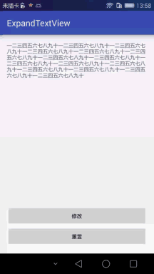

## ExpandTextView ##
一个简单的TextView的扩展,利用装饰模式,直接代码中少许修改
- 效果图

- 原理:
> 通过TextView来获得指定行在文本末尾的索引,然后测量替换文字宽度,最后进行替换显示

- 不足
> 宽度必须match_parent,高度必须wrap_content.

- 待添加功能
> 添加对Spannable支持,添加对图片支持,添加对不同字体颜色大小的支持.

- 导入方式
> compile 'com.qile:expandtext:1.0.0'
